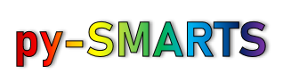

The ``smarts`` module contains functions for calling SMARTS: Simple Model of the
Atmospheric Radiative Transfer of Sunshine, from NREL, developed by 
Dr. Christian Gueymard. 

SMARTS software can be obtained from: 
    https://www.nrel.gov/grid/solar-resource/smarts.html

Users will be responsible to obtain a copy of SMARTS  from NREL, 
honor it’s license, and download the SMART files into their PVLib folder.

This wrapper is shared under a BSD-3-Clause License, and was
originally coded in Matlab by Juan Russo (2001), updated and ported to python
by Silvana Ayala (2019-2020). Original Matlab wrapper was made for graduate studies 
at the University of Arizona, python porting by NREL.

Copyright (c) 2021 National Renewable Energy Laboratory, University of Arizona Board of Regents 

Installation
============

pySMARTS releases may be installed using the ``pip`` and ``conda`` tools. pySMARTSis compatible with Python 3.5 and above.

Install with:

    pip install pySMARTS

For developer installation, download the repository, navigate to the folder location and install as:

    pip install -e .
    
 Please note that you will be responsible of downloading SMARTS 2.9.5 from NREL website, and setting `SMARTSPATH` environment variable to the location of the executable.
  We suggest you install SMARTS on a folder that you have full access and permissions to modify files like your Document folder (i.e. Program Files might give you trouble).
